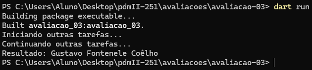
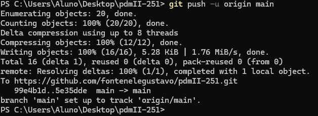

<h1>Enunciado da Atividade:</h1>
Evidenciar a execução do exemplo  de isolates contido no github da disciplina https://github.com/ricdtaveira/mobdev-parte-01/blob/master/16-programacao-assincrona/16-isolates-03.dart.
Para isso :
1) Criar um projeto Dart;
2) Inserir um print de uma string com o seu nome;
3) Fazer um print da execução;
4)  Fazer o push para o github na aba avaliacao-03. 
5)  Postar na entrega da tarefa o link da pasta do github.

<h2>Saídas no Terminal</h2>

